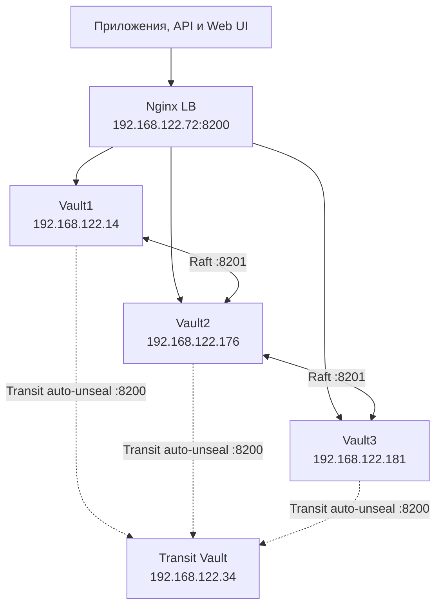

# HashiCorp Vault Cluster с помощью Ansible

Ansible-проект для развёртывания **основного кластера HashiCorp Vault из 3 узлов** с Raft Storage, TLS и Transit auto-unseal. Отдельная Vault-нода хранит Transit-ключ, а Nginx работает как TCP Load Balancer перед основным кластером.

Проект предназначен для воспроизводимого развёртывания небольшого кластера Vault с использованием Ansible Roles.

## Архитектура

Отдельный Vault на `192.168.122.34` хранит Transit-ключ для auto-unseal
основного кластера. Он использует собственные Shamir-ключи и должен быть
распечатан первым после перезапуска. Основные три ноды после этого
распечатываются автоматически. Transit Vault не зависит от основного кластера.

Единственная транзитная ВМ остаётся точкой отказа для перезапуска и unseal
основного кластера: пока она sealed или недоступна, новые старты основных
нод не смогут завершить auto-unseal. Уже работающие ноды продолжают работу.
Сохраняйте резервные копии данных транзитного Vault (`/opt/vault/transit-data`)
и его Shamir-ключей отдельно: потеря Transit-ключа заблокирует последующие
старты основного кластера даже при наличии его Raft snapshot.



### Компоненты

| Компонент           | Назначение                                       |
| ------------------- | ------------------------------------------------ |
| **HashiCorp Vault** | Хранилище и управление секретами                 |
| **Raft**            | Встроенное хранилище Vault и механизм консенсуса |
| **Ansible**         | Автоматизация развёртывания и конфигурации       |
| **Nginx**           | TCP Load Balancer перед Vault                    |
| **TLS**             | Шифрование соединений                            |
| `vault_node`        | Установка и настройка Vault                      |
| `vault_init`        | Инициализация и проверка состояния кластера     |
| `transit_vault`     | Отдельный Vault с Transit-ключом                 |
| `nginx_lb`          | Настройка Nginx в качестве Load Balancer         |

## Структура репозитория

```text
.
├── inventory.ini
├── playbook.yml
├── migrate-transit.yml
├── requirements.yml
├── group_vars/
│   └── vaults.yml
└── roles/
    ├── vault_node/
    │   ├── tasks/
    │   ├── handlers/
    │   ├── templates/
    │   └── ...
    │
    ├── vault_init/
    ├── vault_seal_migrate/
    ├── transit_vault/
    └── nginx_lb/
```

## Требования

### Ansible Control Node

На машине, с которой запускается Ansible, должны быть установлены:

* Ansible
* Python
* SSH-клиент
* SSH-доступ ко всем целевым серверам
* Ansible Collections, указанные в `requirements.yml`

Установить Collections:

```bash
ansible-galaxy collection install -r requirements.yml
```

Используемые Collections:

```yaml
collections:
  - name: ansible.mysql
    version: ">=1.0.0"

  - name: community.zabbix
    version: ">=2.0.0"

  - name: community.crypto
    version: ">=2.0.0"

  - name: community.general
    version: ">=8.0.0"
```

### Целевая инфраструктура

Для текущей конфигурации предполагается:

* 3 Vault-ноды;
* 1 отдельная Transit Vault-нода;
* 1 Nginx Load Balancer;
* SSH-доступ к серверам;
* возможность выполнения команд через `sudo`;
* сетевой доступ между Vault-нодами.

Используемые Vault-порты:

```text
8200/tcp  Vault API
8201/tcp  Vault Cluster Communication
```

## Inventory

Пример inventory:

```ini
[vaults]
Vault1 ansible_host=192.168.122.14
Vault2 ansible_host=192.168.122.176
Vault3 ansible_host=192.168.122.181

[nginx_lb]
NginxLB ansible_host=192.168.122.72

[transit]
TransitVault ansible_host=192.168.122.34
```

SSH-пользователь `k4ips` и настройки privilege escalation задаются в `inventory.ini`.

### Безопасность

**Не следует хранить в Git:**

* приватные SSH-ключи;
* Vault unseal keys;
* Vault root token;
* TLS private keys;
* другие секреты.

Для production рекомендуется использовать Ansible Vault, внешний Secrets Manager или другой механизм безопасной передачи секретов.

## Как работает развёртывание

Основной playbook состоит из четырёх этапов.

### 1. Развёртывание Transit Vault

Роль `transit_vault` устанавливает отдельный Vault, выпускает TLS-сертификат,
инициализирует его с собственными Shamir-ключами и создаёт Transit-ключ
`autounseal` с ограниченным токеном для основных нод.

### 2. Развёртывание основного Vault-кластера

```yaml
- name: Create HashiCorp vault
  hosts: vaults
  become: true
  roles:
    - vault_node
```

Role `vault_node` выполняет:

1. Установку необходимых пакетов.
2. Добавление GPG-ключа HashiCorp.
3. Настройку официального APT-репозитория HashiCorp.
4. Установку Vault.
5. Создание директорий для данных и TLS.
6. Развёртывание TLS-сертификатов.
7. Генерацию `vault.hcl`.
8. Настройку capability `cap_ipc_lock`.
9. Включение и запуск systemd-сервиса Vault.

### 3. Инициализация и auto-unseal

```yaml
- name: Vault cluster — init and unseal
  hosts: vaults
  become: true
  roles:
    - vault_init
```

После запуска Transit Vault первая нода основного кластера инициализируется
с recovery keys, автоматически снимает seal и принимает остальные Raft-ноды.
После присоединения они также снимают seal автоматически.

Результат инициализации сохраняется на Ansible Control Node:

```text
vault-init.json
```

с правами:

```text
0600
```

> **Важно:** этот файл содержит чувствительную информацию, включая recovery keys и root token Vault. Его нельзя добавлять в Git.

Для операций с ключами и токенами используется `no_log: true`, чтобы они не попадали в вывод Ansible.

### 4. Настройка Nginx

```yaml
- name: NginxLb
  hosts: nginx_lb
  become: true
  roles:
    - nginx_lb
```

Role `nginx_lb`:

* устанавливает `nginx-full`;
* проверяет наличие модуля `stream`;
* разворачивает конфигурацию Nginx;
* проверяет конфигурацию через `nginx -t`;
* включает и запускает Nginx.

Nginx работает как **TCP proxy** перед основным Vault-кластером. Следующая
схема показывает только маршрут клиентских запросов; соединения основных
нод с Transit Vault показаны в общей схеме архитектуры выше.

```text
Client
  │
  │ TCP :8200
  ▼
Nginx
  │
  ├──────────► Vault 1
  │
  ├──────────► Vault 2
  │
  └──────────► Vault 3
```

## Установка

Клонируем репозиторий:

```bash
git clone https://github.com/Cakecrisps/HashiCorpAnsible.git
cd HashiCorpAnsible
```

Устанавливаем Ansible Collections:

```bash
ansible-galaxy collection install -r requirements.yml
```

Проверяем доступность серверов:

```bash
ansible -i inventory.ini all -m ping --ask-become-pass
```

Запускаем развёртывание:

```bash
ansible-playbook -i inventory.ini playbook.yml --ask-become-pass
```

Для получения дополнительной информации:

```bash
ansible-playbook -i inventory.ini playbook.yml --ask-become-pass -v
```

Для детальной диагностики:

```bash
ansible-playbook -i inventory.ini playbook.yml --ask-become-pass -vvv
```

## Bootstrap Vault-кластера

Первая Vault-нода используется для создания первоначального кластера.

Перед выполнением `vault operator init` role проверяет, был ли Vault уже инициализирован. Это позволяет повторно запускать playbook без повторной инициализации существующего кластера.

Количество ключей и threshold задаются через переменные:

```yaml
vault_unseal_key_shares:
vault_unseal_key_threshold:
```

При Transit seal эти параметры задают количество recovery keys и порог.
Они нужны для привилегированных recovery-операций, а при старте основные
ноды обращаются к транзитному Vault.

### Порядок запуска

```text
Transit Vault unsealed → Основной leader auto-unsealed → Followers join Raft → Followers auto-unsealed
```

## Transit auto-unseal

Обычный запуск `ansible-playbook -i inventory.ini playbook.yml --ask-become-pass`
сначала приводит в рабочее состояние Transit Vault, затем настраивает
основной кластер. Transit seal включён в `group_vars/vaults.yml`.

На управляющей машине вне репозитория хранятся:

* `~/vault-lab-secrets/transit-init.json` — Shamir-ключи и root token транзитного Vault;
* `~/vault-lab-secrets/transit-seal.token` — ограниченный периодический токен основного кластера;
* `~/vault-lab-secrets/vault-pre-transit.snap` — Raft snapshot до миграции;
* `~/vault-lab-secrets/vault-init.json` — исходные ключи основного кластера, после миграции используемые как recovery keys.

В конфигурацию Vault токен не записывается: systemd загружает его из
`/etc/vault.d/transit-seal.env` с правами `0600`. Политика токена разрешает
только `transit/encrypt/autounseal` и `transit/decrypt/autounseal`.

После перезапуска транзитной ВМ её нужно распечатать тремя ключами из
`transit-init.json`. На самой ВМ выполните эту команду три раза, вводя
разные ключи по запросу:

```bash
sudo env VAULT_ADDR=https://127.0.0.1:8200 \
  VAULT_CACERT=/opt/vault/tls/ca.crt vault operator unseal
```

Затем основные ноды смогут auto-unseal при старте.

Для уже инициализированного Shamir-кластера предусмотрен одноразовый
`migrate-transit.yml`: он сохраняет snapshot, проверяет Transit и переводит
standby-ноды по одной, затем бывшего лидера. Повторная миграция не нужна.
Миграция seal требует краткого простоя. [Порядок миграции](https://developer.hashicorp.com/vault/docs/concepts/seal#seal-migration)
и [ограничения Transit auto-unseal](https://developer.hashicorp.com/vault/docs/configuration/seal/transit-best-practices)
описаны в документации HashiCorp.

## TLS

Vault-ноды используют TLS для защищённого взаимодействия.

Основной конфигурационный файл Vault:

```text
/etc/vault.d/vault.hcl
```
На управляющей машине:

```bash
export VAULT_ADDR=https://192.168.122.72:8200
export VAULT_CACERT="$HOME/vault-lab-secrets/pki/ca.crt"
```

На другой клиентской машине укажите путь к копии этого `ca.crt`.
Для локальной проверки от root на Vault-ноде используйте
`VAULT_ADDR=https://127.0.0.1:8200` и `VAULT_CACERT=/opt/vault/tls/ca.crt`.
Сертификат Vault содержит IP-адреса нод и балансировщика в SAN; Nginx
передаёт TLS-соединение на Vault без его завершения.

TLS-файлы хранятся в отдельной директории с ограниченными правами доступа.

При создании сертификатов необходимо учитывать:

* DNS-имена Vault-нод;
* IP-адреса Vault-нод;
* имя Load Balancer;
* IP-адрес Load Balancer;
* корректный CA;
* SAN в сертификатах.

## Использование секретов

Клиенты подключаются к основному кластеру через
`https://192.168.122.72:8200`. Отдельный Transit Vault на
`192.168.122.34` используется только для auto-unseal; секреты приложений
создаются в основном кластере.

### Web UI и HTTP API

Web UI доступен по адресу `https://192.168.122.72:8200/ui/`. Клиентский
браузер должен доверять CA из `~/vault-lab-secrets/pki/ca.crt`. На других
машинах используется копия этого сертификата CA.

Для пробного секрета в Web UI откройте **Secrets → Enable new engine → KV**,
выберите **Version 2** и путь монтирования `demo`. Затем создайте секрет
`demo-secret` с тестовыми полями. Если движок `demo/` уже существует,
создайте секрет в нём.

При KV v2 путь в интерфейсе `demo/demo-secret` соответствует HTTP API
`/v1/demo/data/demo-secret`. Токен с политикой `read` на этом API-пути
может получить значение напрямую, без отдельного запроса входа:

```bash
VAULT_ADDR=https://192.168.122.72:8200
VAULT_CACERT="$HOME/vault-lab-secrets/pki/ca.crt"
# VAULT_TOKEN — отдельный токен с доступом к нужному пути.
curl --fail --silent --show-error --cacert "$VAULT_CACERT" \
  -H "X-Vault-Token: $VAULT_TOKEN" \
  "$VAULT_ADDR/v1/demo/data/demo-secret"
```

Политика для чтения одного секрета:

```hcl
path "demo/data/demo-secret" {
  capabilities = ["read"]
}
```

Для KV v2 чтение значений выполняется через `data/`, а просмотр списка
ключей — через `metadata/`. Токен выдаётся приложению отдельно от root
token и получает только необходимые права. [API KV v2](https://developer.hashicorp.com/vault/api-docs/secret/kv/kv-v2),
[ACL-политики](https://developer.hashicorp.com/vault/docs/concepts/policies).

### Vault Agent на сервере приложения: существующий пароль БД

Этот сценарий переносит уже существующий пароль БД в KV v2. Например,
секрет `secret/myapp/db` содержит поле `password`; имя пользователя БД
остаётся в конфигурации приложения. Путь монтирования `secret/` нужно
создать заранее, если его ещё нет.

Vault Agent устанавливается **на сервере приложения**. Отдельная AppRole
для приложения получает политику:

```hcl
path "secret/data/myapp/db" {
  capabilities = ["read"]
}
```

RoleID и SecretID этой AppRole доставляются на сервер приложения отдельно.
Agent работает от учётной записи приложения, а файлы с RoleID и SecretID
доступны только этой записи. Пример `/etc/myapp-vault/agent.hcl`:

```hcl
vault {
  address = "https://192.168.122.72:8200"
  ca_cert = "/etc/myapp-vault/ca.crt"
}

auto_auth {
  method {
    type = "approle"
    config = {
      role_id_file_path = "/etc/myapp-vault/role_id"
      secret_id_file_path = "/etc/myapp-vault/secret_id"
      remove_secret_id_file_after_reading = false
    }
  }
}

template_config {
  static_secret_render_interval = "5m"
}

template {
  contents = "{{ with secret \"secret/data/myapp/db\" }}{{ .Data.data.password }}{{ end }}"
  destination = "/run/myapp/db-password"
  perms = "0600"
  backup = false
  error_on_missing_key = true
}
```

Если Agent используется только для шаблона, отдельный файл с Vault token
не нужен: Agent получает и обновляет токен сам. Каталог `/run/myapp`
должен существовать и быть доступен учётной записи приложения. Agent
запускается как постоянный systemd-сервис; приложение стартует после
появления `/run/myapp/db-password` и перечитывает файл при изменении.
Для приложения без перечитывания настраивается контролируемый reload через
`template.exec`. Без reload смена файла не меняет уже открытые соединения
с БД. [Vault Agent auto-auth](https://developer.hashicorp.com/vault/docs/agent-and-proxy/autoauth),
[шаблоны Agent](https://developer.hashicorp.com/vault/docs/agent-and-proxy/agent/template).

Параметр `remove_secret_id_file_after_reading = false` сохраняет SecretID
для повторного входа Agent после перезапуска VM. Поэтому SecretID должен
иметь ограниченный доступ и плановую замену. Одноразовый SecretID без
механизма повторной доставки не обеспечит автоматический запуск после
перезагрузки. [AppRole auto-auth](https://developer.hashicorp.com/vault/docs/agent-and-proxy/autoauth/methods/approle).

Запись нового значения в KV v2 **не меняет пароль в самой БД**. При
переходе со старой конфигурации сначала проверяется чтение файла и
подключение тестового экземпляра, затем переключаются остальные
экземпляры и меняется пароль в БД с согласованным обновлением Vault.

### Учётные данные, которыми управляет Vault

Для автоматической ротации используется [Database secrets engine](https://developer.hashicorp.com/vault/docs/secrets/databases):

* **Static role** закрепляет за ролью существующего пользователя БД и
  меняет его пароль по расписанию. Приложение должно подхватывать новый
  пароль и обновлять соединения.
* **Dynamic role** создаёт отдельного временного пользователя для
  экземпляра приложения. Приложение должно заменить учётные данные
  соединений до истечения срока действия выданного секрета.

Политика приложения для динамической роли `myapp-ro`:

```hcl
path "database/creds/myapp-ro" {
  capabilities = ["read"]
}
```

Vault Agent может читать этот путь через шаблон и записывать имя
пользователя и пароль в защищённые файлы. Срок действия учётных данных,
повторное получение и реакция приложения на изменение проверяются до
перевода рабочих экземпляров. [Поведение Agent при обновлении секретов](https://developer.hashicorp.com/vault/docs/agent-and-proxy/agent/template#renewals-and-updating-secrets).

## Конфигурация

Основные параметры должны задаваться через Ansible variables.

В зависимости от используемой конфигурации могут использоваться:

```yaml
vault_data_dir:
vault_tls_dir:
vault_secrets_local_dir:
vault_unseal_key_shares:
vault_unseal_key_threshold:
vault_env:
```

Перед использованием проекта в новой инфраструктуре рекомендуется проверить `defaults`, `vars` и templates соответствующих ролей.

## Проверка после развёртывания

### Vault

На управляющей машине проверить TLS, LB и все Vault-ноды:

```bash
CA="$HOME/vault-lab-secrets/pki/ca.crt"
curl --silent --show-error --cacert "$CA" \
  -o /dev/null -w 'LB: HTTP %{http_code}, TLS %{ssl_verify_result}\n' \
  'https://192.168.122.72:8200/v1/sys/health?standbyok=true'

for IP in 192.168.122.14 192.168.122.176 192.168.122.181; do
  echo "=== $IP ==="
  curl --fail --silent --show-error --cacert "$CA" \
    "https://$IP:8200/v1/sys/seal-status"
  echo
done
```

Для каждой основной ноды ожидаются `"type":"transit"` и
`"sealed":false`. У LB ожидаются HTTP `200` и TLS `0`.

Отдельно проверить Transit Vault:

```bash
curl --fail --silent --show-error --cacert "$CA" \
  'https://192.168.122.34:8200/v1/sys/seal-status'
```

Для Transit Vault ожидаются `"type":"shamir"` и `"sealed":false`.
На конкретной Vault-ноде состояние сервиса и локального API проверяется так:

```bash
systemctl status vault
sudo env VAULT_ADDR=https://127.0.0.1:8200 \
  VAULT_CACERT=/opt/vault/tls/ca.crt vault status
```

### Raft

Проверить участников основного кластера с административным Vault token
и настроенными `VAULT_ADDR` и `VAULT_CACERT`:

```bash
vault operator raft list-peers
```

Ожидаемый результат — три Vault-ноды, объединённые в один Raft-кластер.

### Nginx

Проверить сервис:

```bash
systemctl status nginx
```

Проверить конфигурацию:

```bash
nginx -t
```

## Диагностика

### Vault-нода не подключается к кластеру

Проверить сетевую доступность:

```bash
nc -vz <leader-ip> 8200
nc -vz <leader-ip> 8201
```

Проверить:

* Leader действительно unsealed;
* порт `8200` доступен;
* порт `8201` доступен;
* TLS-сертификаты корректны;
* CA соответствует сертификатам;
* `retry_join` указывает на правильную ноду.

### Vault находится в состоянии Sealed

Проверить тип seal и состояние транзитной ноды командой из раздела
«Проверка после развёртывания». Если Transit Vault sealed, распечатать
его **собственными** ключами из `~/vault-lab-secrets/transit-init.json`.
Если Transit Vault работает, проверить доступность порта `8200`, CA,
ограниченный токен в `/etc/vault.d/transit-seal.env` и журнал основной
Vault-ноды:

```bash
journalctl -u vault
```

Файлы `transit-init.json` и `vault-init.json` не передаются в issue,
чаты или логи.

### Nginx не запускается

Проверить конфигурацию:

```bash
nginx -t
```

Посмотреть логи:

```bash
journalctl -u nginx
```

Проверить наличие `stream` module.

### Vault не запускается

Проверить:

```bash
systemctl status vault
```

и:

```bash
journalctl -u vault
```

Дополнительно проверить:

```text
/etc/vault.d/vault.hcl
```

а также:

* пути к TLS-сертификатам;
* права на TLS-файлы;
* права на Vault data directory;
* `cap_ipc_lock`.

## Безопасность

Проект работает с критически важными секретами, поэтому необходимо уделить особое внимание безопасности Ansible Control Node.

### Никогда не коммитить

```text
vault-init.json
*.key
*.pem
*.crt
id_rsa
id_ed25519
Vault root token
Vault unseal keys
```

Если TLS-сертификаты используются только для тестовой инфраструктуры, они всё равно должны быть явно отделены от production credentials.

### `vault-init.json`

Файл:

```text
vault-init.json
```

содержит данные, полученные при инициализации Vault.

Рекомендуется:

* хранить его только на защищённом Control Node;
* ограничить права до `0600`;
* исключить его из Git;
* не передавать его через незащищённые каналы;
* не включать его содержимое в CI/CD logs.

### Production

Для production deployment рекомендуется рассмотреть:

* Auto Unseal через KMS/HSM;
* централизованное управление секретами;
* отдельное хранение unseal keys;
* сетевую сегментацию;
* firewall rules;
* TLS certificate rotation;
* мониторинг Vault;
* аудит;
* hardened SSH;
* Ansible Vault или внешний Secrets Manager;
* отказ от хранения credentials непосредственно в `inventory.ini`.

## Idempotency

Playbook рассчитан на повторный запуск.

Role `vault_init` проверяет текущее состояние Vault перед выполнением initialization, что позволяет избежать повторного запуска:

```bash
vault operator init
```

для уже инициализированного кластера.

Поэтому после изменения конфигурации можно повторно выполнить:

```bash
ansible-playbook -i inventory.ini playbook.yml --ask-become-pass
```

и Ansible синхронизирует инфраструктуру с описанной конфигурацией.

## Проверка Ansible

Перед запуском playbook рекомендуется выполнить syntax check:

```bash
ansible-playbook \
  -i inventory.ini \
  playbook.yml \
  --syntax-check
```

Посмотреть структуру inventory:

```bash
ansible-inventory \
  -i inventory.ini \
  --graph
```

Выполнить check mode:

```bash
ansible-playbook \
  -i inventory.ini \
  playbook.yml \
  --check --ask-become-pass
```

Для разработки рекомендуется использовать отдельные тестовые VM, а не существующий production Vault-кластер.

## Известные моменты

### `inventory.ini`

В текущем inventory присутствуют конкретные IP-адреса инфраструктуры и SSH-пользователь.

Перед публикацией репозитория стоит убедиться, что:

* IP-адреса не относятся к production-инфраструктуре;
* SSH private key не находится в репозитории;
* credentials не находятся в Git history.

## Лицензия

Лицензия проекта пока не указана.

## Полезные ссылки

* [HashiCorp Vault](https://developer.hashicorp.com/vault)
* [Vault Raft Storage](https://developer.hashicorp.com/vault/docs/concepts/storage/raft)
* [Ansible](https://docs.ansible.com/)
* [Ansible Collections](https://docs.ansible.com/ansible/latest/collections_guide/index.html)

## Автор

[github.com/Cakecrisps](https://github.com/Cakecrisps)

---

**Проект:** HashiCorp Vault Cluster + Ansible
**Репозиторий:** https://github.com/Cakecrisps/HashiCorpAnsible
